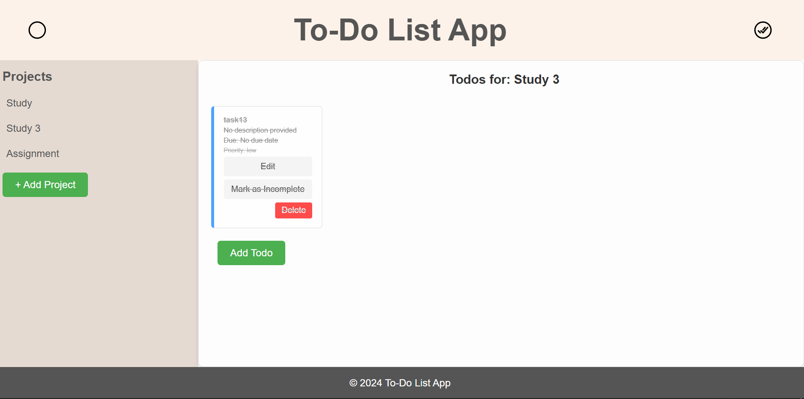

# TO DO LIST

A simple and interactive task management application built with **JavaScript**, **HTML**, and **CSS**. This project is guided by [The Odin Project](https://www.theodinproject.com/) curriculum and focuses on organizing projects and their associated tasks effectively.

---

## 🚀 Live Demo

[TO DO LIST - Live Site](https://adnan7389.github.io/TO_DO_LIST/)

---

## 📂 Features

- **Add Projects**: Organize tasks under different projects.
- **Add Tasks**: Assign tasks to projects with additional details like priority and due dates.
- **Mark Tasks as Completed**: Toggle completion status for tasks.
- **Edit Tasks**: Update task details such as title, description, and due date.
- **Delete Projects/Tasks**: Clean up projects and tasks when they are no longer needed.
- **Persistent Storage**: Save tasks and projects using local storage.

---

## 🛠️ Technologies Used

- **HTML**: Structuring the application layout.
- **CSS**: Styling for an interactive and user-friendly UI.
- **JavaScript**: Core functionality, task/project management, and DOM manipulation.
- **Local Storage**: To persist user data.

---

## 📑 How to Use

1. **View the Live Site**: Visit the [Live Demo](https://adnan7389.github.io/TO_DO_LIST/).
2. **Add a Project**: Use the "Add Project" button to create a new project.
3. **Manage Tasks**:
   - Add tasks to projects by clicking "Add Task".
   - Mark tasks as completed or incomplete.
   - Edit or delete tasks as required.
4. **Save Progress**: All data is automatically saved and reloaded from local storage.

---

## 🧑‍💻 Getting Started Locally

Follow these steps to set up the project on your local machine:

1. **Clone the Repository**:
   ```bash
   git clone https://github.com/Adnan7389/TO_DO_LIST.git
   ```
2. **Navigate to the Project Directory**:
   ```bash
   cd TO_DO_LIST
   ```
3. **Open the App**:
   - Open `index.html` in your browser.
   - Or, use a live server extension in your code editor.

---

## 📸 Screenshot

### Home Page



---

## 📚 Lessons Learned

This project helped me:

- Understand **object-oriented programming (OOP)** concepts.
- Improve **DOM manipulation** skills using vanilla JavaScript.
- Utilize **local storage** for data persistence.
- Implement a modular architecture with **separation of concerns**.

---

## 🌟 Acknowledgments

- Guided by [The Odin Project](https://www.theodinproject.com/).
- Thanks to the open-source community for their valuable feedback.

---

## 🤝 Contributions

Contributions, issues, and feature requests are welcome! Feel free to open an issue or submit a pull request.

---

## 📝 License

This project is open-source and available under the [MIT License](https://opensource.org/licenses/MIT).
